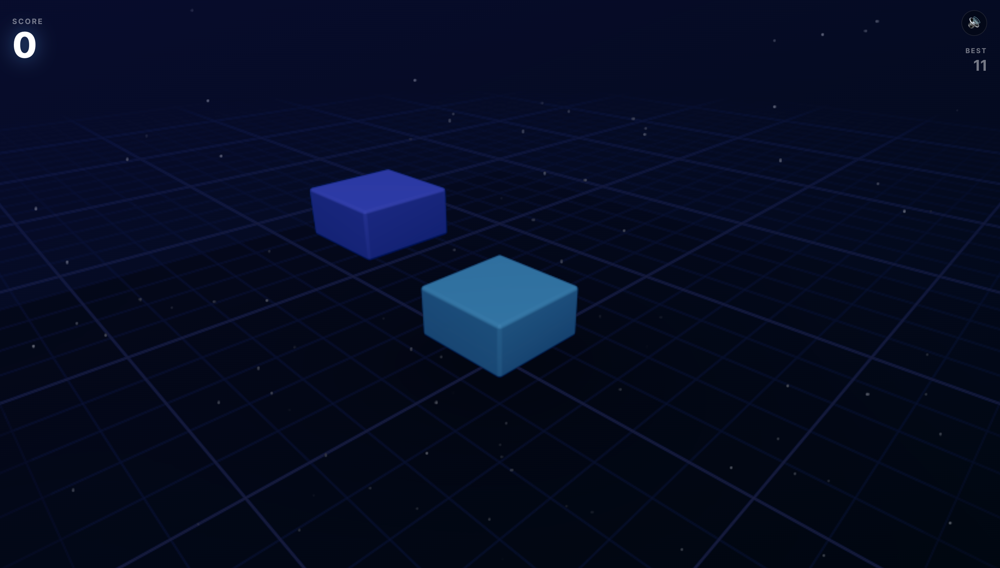
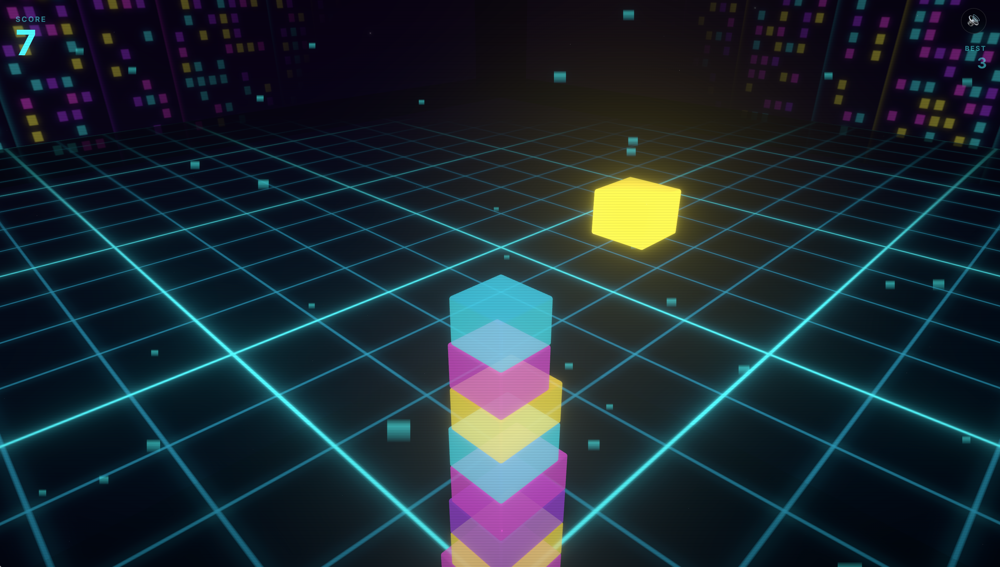
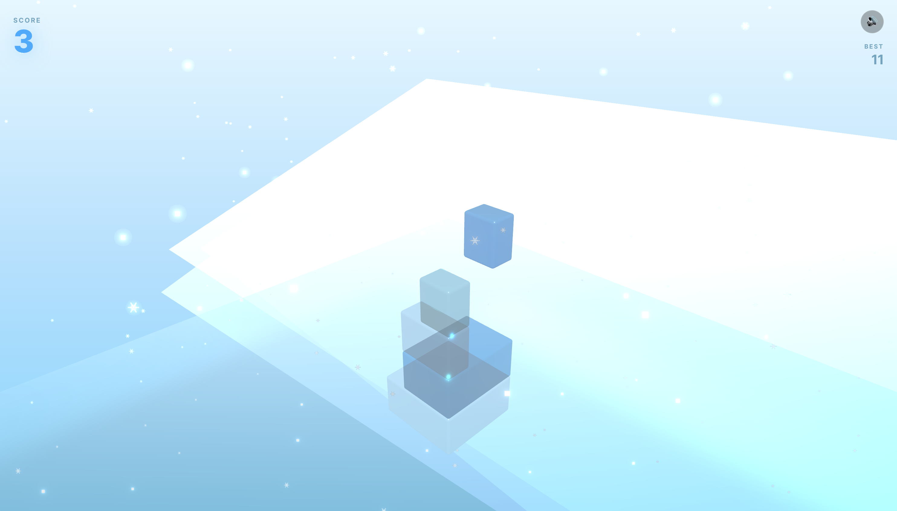
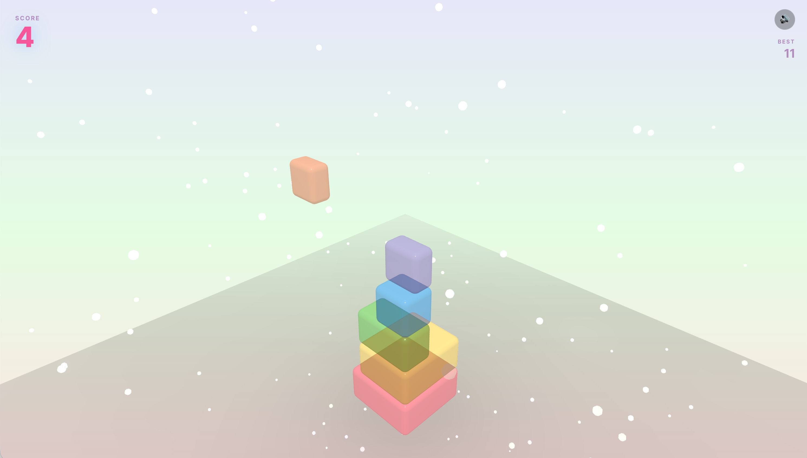

# 🎮 Tower Stacking

> **Test your timing. Build the tallest tower.**

An addictive 3D stacking game where precision is everything. Click at the perfect moment to stack blocks and reach for the sky!

[](https://tower-stacking.vercel.app)

## 🎬 Preview


## ✨ Features

- 🎯 **Precision Timing** - Click at the perfect moment to stack
- 🎨 **4 Unique Themes** - Classic, Neon City, Ice Crystal, Jelly
- ⚡ **Physics-Based** - Realistic falling animations for missed parts
- 🔊 **Sound Effects** - Procedural audio using Web Audio API
- 📊 **Score Tracking** - Beat your high score
- 📱 **Mobile Friendly** - Play on any device

## 🎮 How to Play

1. **Choose a theme** on the start screen
2. **Click "START"** to begin
3. **Click/Tap** to drop the moving block
4. **Stack perfectly** to build higher
5. **Beat your high score!**

💡 **Pro Tip:** Perfect placement (100% overlap) gives bonus points!

## 🛠 Tech Stack


- **Next.js 15** - React framework
- **React Three Fiber** - React renderer for Three.js
- **Three.js** - 3D graphics library
- **TypeScript** - Type safety
- **Web Audio API** - Procedural sound generation

## 🎨 Themes
<div align="center">
  
  
  
  
</div>

### 🎮 Classic
Clean, minimal design with rainbow blocks and starfield background.

### 🌃 Neon City
Cyberpunk aesthetic with glowing edges and grid floor.

### 🧊 Ice Crystal
Winter wonderland with transparent ice blocks and aurora effects.

### 🍮 Jelly
Cute and bouncy with pastel colors and wobble animations.

## 🎯 Game Mechanics

**Stacking Logic:**
1. Block moves horizontally
2. Click to drop
3. Only overlapping area stays
4. Rest falls with physics
5. Perfect stack = bonus points!

**Scoring:**
- +1 point per successful stack
- +2 bonus for perfect placement
- High score saved locally


## 🚀 Quick Start
```bash
# Clone the repository
git clone https://github.com/nahyun27/tower-stacking.git
cd tower-stacking

# Install dependencies
npm install

# Run development server
npm run dev
```

Open [http://localhost:3000](http://localhost:3000) and start playing!

---

<div align="center">

**Try the game and let me know what I should improve!**
*📧 ksknh7@hanyang.ac.kr*

</div>